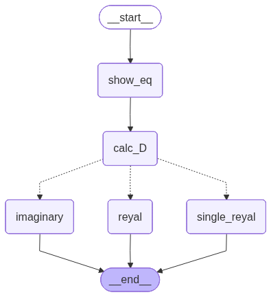

# LangGraphX: Smart Equation Solver  

LangGraphX is a **conditional workflow project** built using [LangGraph](https://github.com/langchain-ai/langgraph).  
It demonstrates how to use **graph-based execution flows** to solve quadratic equations intelligently, by branching logic based on discriminants and conditions.  

This project is not just a quadratic solver—it’s a **learning resource** for anyone exploring LangGraph’s ability to model **stateful, conditional pipelines**.  

---

## 🚀 Features
- 📐 **Quadratic Equation Solver** – Handles quadratic equations of the form *ax² + bx + c = 0*.  
- 🔀 **Conditional Flow with LangGraph** – Uses **conditional edges** to branch based on the discriminant:
  - **D > 0** → Two distinct real roots  
  - **D = 0** → One real root  
  - **D < 0** → Complex roots  
- 🧩 **Graph Components** – Nodes represent computational steps; edges represent decision-making flow.  
- 📒 **Jupyter Notebook Demo** – Run interactively and visualize the workflow.  

---

## 📂 Project Structure
```
├── quadEq_conditional.ipynb   # Main notebook containing the project
├── README.md                  # Project documentation
```

---

## 🛠️ Installation
Make sure you have **Python 3.9+** installed. Then install the required dependencies:

```bash
pip install langgraph langchain-core langchain-community
```

(Optionally, you may also need `jupyter` to run the notebook.)

---

## ▶️ Usage
1. Clone this repository:
   ```bash
   git clone https://github.com/hendrix0731/LangGraphX-Smart-Equation-Solver-.git
   cd LangGraphX-Smart-Equation-Solver-
   ```
2. Launch Jupyter Notebook:
   ```bash
   jupyter notebook quadEq_conditional.ipynb
   ```
3. Follow the cells to explore:
   - Input coefficients (*a, b, c*).  
   - Watch LangGraph handle branching with conditional edges.  
   - Get real or complex roots depending on the discriminant.  

---

## 🔎 How It Works
LangGraph allows you to define **nodes** (functions/tasks) and connect them with **edges**.  

In this project:  
- **Start Node** → Accepts coefficients `a, b, c`.  
- **Discriminant Node** → Calculates `D = b² - 4ac`.  
- **Conditional Edges** → Directs flow depending on `D`.  
- **Root Solver Nodes** → Compute and return results.  

This illustrates how **graph workflows** can model **decision trees** in algebraic computation.  

---

## 📖 Example
Input:  
```
a = 1, b = -3, c = 2
```

Discriminant:  
```
D = 1
```

Output (via LangGraph flow):  
```
Two real roots: x1 = 1.0, x2 = 2.0
```

---

## 🗺️ Workflow Illustration
Here’s a simple flow diagram of how the project works:

```
         ┌───────────────┐
         │   Start Node  │
         │ (Input a,b,c) │
         └───────┬───────┘
                 │
                 ▼
        ┌──────────────────┐
        │ Discriminant Node│
        │   D = b² - 4ac   │
        └───────┬──────────┘
      ┌─────────┼────────────┐
      │         │            │
      ▼         ▼            ▼
┌─────────┐ ┌─────────┐ ┌─────────────┐
│ D > 0   │ │ D = 0   │ │   D < 0     │
│ Two roots││ One root │ │ Complex roots│
└─────────┘ └─────────┘ └─────────────┘
```


---

## 📌 Future Enhancements
- Extend solver to **cubic and higher-order polynomials**  
- Add a **CLI tool** for quick solving  
- Integrate **visual graph visualization** of workflows  

---
